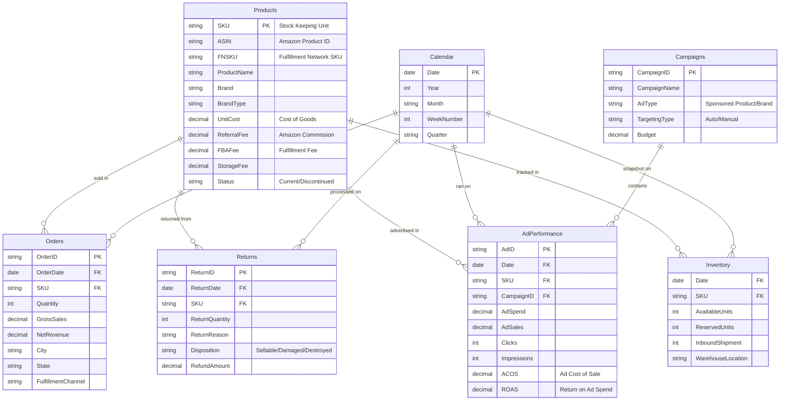

## Amazon E-Commerce Data Model

```mermaid
erDiagram
    %% Product Catalog
    Products {
        string SKU PK "Stock Keeping Unit"
        string ASIN "Amazon Product ID"
        string FNSKU "Fulfillment Network SKU"
        string ProductName
        string Brand
        string BrandType
        decimal UnitCost "Cost of Goods"
        decimal ReferralFee "Amazon Commission"
        decimal FBAFee "Fulfillment Fee"
        decimal StorageFee
        string Status "Current/Discontinued"
    }

    Calendar {
        date Date PK
        int Year
        string Month
        int WeekNumber
        string Quarter
    }

    Campaigns {
        string CampaignID PK
        string CampaignName
        string AdType "Sponsored Product/Brand"
        string TargetingType "Auto/Manual"
        decimal Budget
    }

    %% Transaction Tables
    Orders {
        string OrderID PK
        date OrderDate FK
        string SKU FK
        int Quantity
        decimal GrossSales
        decimal NetRevenue
        string City
        string State
        string FulfillmentChannel
    }

    Returns {
        string ReturnID PK
        date ReturnDate FK
        string SKU FK
        int ReturnQuantity
        string ReturnReason
        string Disposition "Sellable/Damaged/Destroyed"
        decimal RefundAmount
    }

    AdPerformance {
        string AdID PK
        date Date FK
        string SKU FK
        string CampaignID FK
        decimal AdSpend
        decimal AdSales
        int Clicks
        int Impressions
        decimal ACOS "Ad Cost of Sale"
        decimal ROAS "Return on Ad Spend"
    }

    Inventory {
        date Date FK
        string SKU FK
        int AvailableUnits
        int ReservedUnits
        int InboundShipment
        string WarehouseLocation
    }

    %% Relationships
    Products ||--o{ Orders : "sold in"
    Products ||--o{ Returns : "returned from"
    Products ||--o{ AdPerformance : "advertised in"
    Products ||--o{ Inventory : "tracked in"

    Calendar ||--o{ Orders : "placed on"
    Calendar ||--o{ Returns : "processed on"
    Calendar ||--o{ AdPerformance : "ran on"
    Calendar ||--o{ Inventory : "snapshot on"

    Campaigns ||--o{ AdPerformance : "contains"
```
