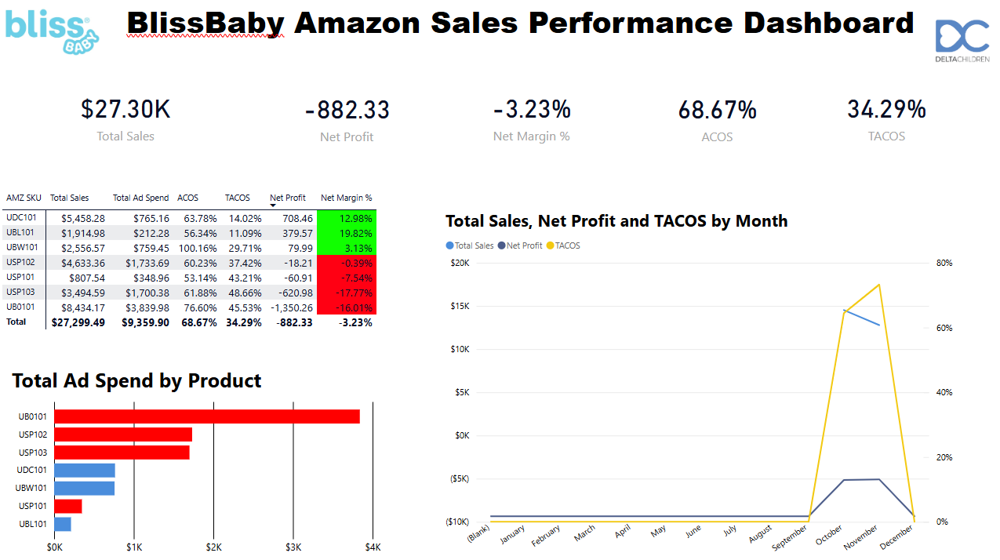

# Amazon BlissBaby E-Commerce Data Analysis

Duration: 12 Months (January-December 2025).

## Analysis Workflow

**Data Pipeline:**
1. Raw data sampled and imported to Power BI for initial exploration
2. Database cleaned using SQL views and queries
3. Detailed metrics calculated and analyzed
4. Key insights identified through exploratory analysis

**Deliverables:**
- `detailed_analysis.py` - SQL-cleaned data with detailed calculations
- `KeyInsights.ipynb` - Business question analysis with visualizations

## Data Model Architecture

### Star Schema Design

```
                    ┌─────────────────┐
                    │   Dim_Product   │
                    ├─────────────────┤
                    │ ProductID (PK)  │
                    │ SKU             │
                    │ ProductName     │
                    │ Category        │
                    │ Price           │
                    └────────┬────────┘
                             │
                             │
        ┌────────────────────┼────────────────────┐
        │                    │                    │
┌───────┴────────┐  ┌────────┴────────┐  ┌───────┴────────┐
│   Dim_Date     │  │   Fact_Sales    │  │ Dim_Customer   │
├────────────────┤  ├─────────────────┤  ├────────────────┤
│ DateID (PK)    │──│ SaleID (PK)     │──│ CustomerID(PK) │
│ Date           │  │ DateID (FK)     │  │ CustomerName   │
│ Day            │  │ ProductID (FK)  │  │ Location       │
│ Month          │  │ CustomerID (FK) │  │ JoinDate       │
│ Year           │  │ Quantity        │  └────────────────┘
│ Quarter        │  │ TotalSales      │
│ DayOfWeek      │  │ AdSpend         │
└────────────────┘  │ AdClicks        │
                    │ Returns         │
                    │ NetProfit       │
                    │ ACOS            │
                    │ TACOS           │
                    └─────────────────┘
```

 

## Visualizations

### Interactive Dashboard Analysis


**Dashboard Highlights:**
- **Total Sales:** $27.30K with -3.23% net margin
- **Advertising Efficiency:** 68.67% ACoS, 34.29% TACoS
- **Peak Performance:** October-November period shows significant TACOS spike
- **Top SKU:** UB0101 dominates ad spend with $3.8K investment

## Power BI DAX Measures

### Revenue Metrics
**Total Sales**
```dax
Total Sales = SUM('Product_Sales'[item-price])
```

**Total Ad Sales**
```dax
Total Ad Sales = SUM('Fact_Ads'[Sales])
```

### Cost Metrics
**Total COGS**
```dax
Total COGS = 
SUMX(
    'Product_Sales', 
    'Product_Sales'[quantity] * RELATED('Dim_Products'[COST])
)
```

**Total Fees**
```dax
Total Fees = 
SUMX(
    'Product_Sales', 
    ('Product_Sales'[item-price] * 0.15) + 
    ('Product_Sales'[quantity] * RELATED('Dim_Products'[FBA COST]))
)
```

**Total Ad Spend**
```dax
Total Ad Spend = SUM('Fact_Ads'[Spend])
```

### Profitability Metrics
**Net Profit**
```dax
Net Profit = [Total Sales] - [Total COGS] - [Total Fees] - [Total Ad Spend]
```

**Net Margin %**
```dax
Net Margin % = DIVIDE([Net Profit], [Total Sales], 0)
```

### Advertising Performance Metrics
**ACOS (Advertising Cost of Sale)**
```dax
ACOS = DIVIDE([Total Ad Spend], [Total Ad Sales], 0)
```

**TACOS (Total Advertising Cost of Sale)**
```dax
TACOS = DIVIDE([Total Ad Spend], [Total Sales], 0)
```

## Business Questions & Findings

### 1. When are products most returned?
November shows 82% of returns (28 of 34 total). Fridays peak with 7 returns.

### 2. Product with most ads and clicks?
UB0101 leads with 2,328 clicks and $645 ad spend. Highest impressions at 532,365.

### 3. Is the most advertised product also the best seller?
Yes. UB0101 has both highest ad volume and 524 units sold. The 49% organic sales component indicates strong brand recognition beyond paid channels.

### 4. Least performing products?
UBW101 ($1.72 ROAS), UBL101 (172 clicks), USP101 (6.52% return rate) need optimization.

## Running the Analysis

### Detailed Metrics (Python)
```bash
python detailed_analysis.py
```
Outputs:
- Aggregate KPIs (Total Sales, Ad Spend, ACoS, TACoS, Net Margin)
- SKU-level performance breakdown
- Monthly trends
- Visualizations & Plots

### Key Insights (Jupyter)
```bash
jupyter notebook KeyInsights.ipynb
```
Covers:
- Return timing and patterns
- Advertising performance comparison
- Sales vs ad correlation
- Weak performer analysis with visualizations


## Technical Stack
- **Data Processing:** Python, SQL
- **Visualization:** Power BI, Matplotlib, Seaborn
- **Analysis:** Pandas, NumPy, Jupyter Notebook
